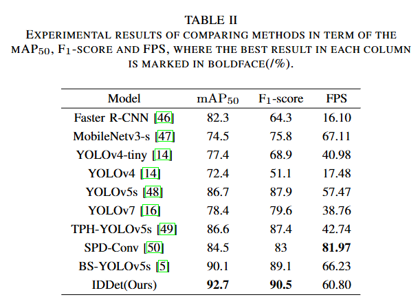

# IDDet：Insulator Defect Detector via Residual Denoising Diffusion Mechanism

IDDet is a diffusion-based detector for quickly and accurately detecting insulators with defects.

## IDDet


*Fig. 1 framework of our proposed IDDet. The backbone extracts feature maps from the input Insulator defects image. Taking noisy bounding boxes and multiscale features as input, the detector then predicts the target category, positions (center coordinates), and sizes (widths and heights) of bounding boxes.*

## Configs

#### requires

 Python 3.7+

 CUDA 9.2+

PyTorch 1.8+

[MMDetection](https://github.com/open-mmlab/mmdetection)

#### Training

```bash
python tools/train.py IDDet/configs/config.py
```

#### Testing

```bash
python tools/test.py IDDet/configs/config.py
```

## datasets

download the dataset: [WI](https://pan.baidu.com/s/1lgG6BX1Ac9b8_gAwSMOQ0g) (code: j8cx).

## trained model

We provide .pth of our IDDet trained on the WI dataset: [IDDet]()

## results (qualitative results)



*fig. 2 Experimental results of comparing methods in term of the mAP$_{50}$, F$_1$-score and FPS, where the best result in each column is marked in boldface.*

## results (qualitative results)


*fig. 5 Visualization of detection results under different methods on randomly selected images. Yellow boxes represent ground truth, and red boxes indicate detection results.(a) input images and ground-truth boxes, (b) IDDet, (c) BS-YOLOv5s, (d) YOLOv5s, (e) TPH-YOLOv5s, (f) SPD-Conv, (g) Faster R-CNN*
